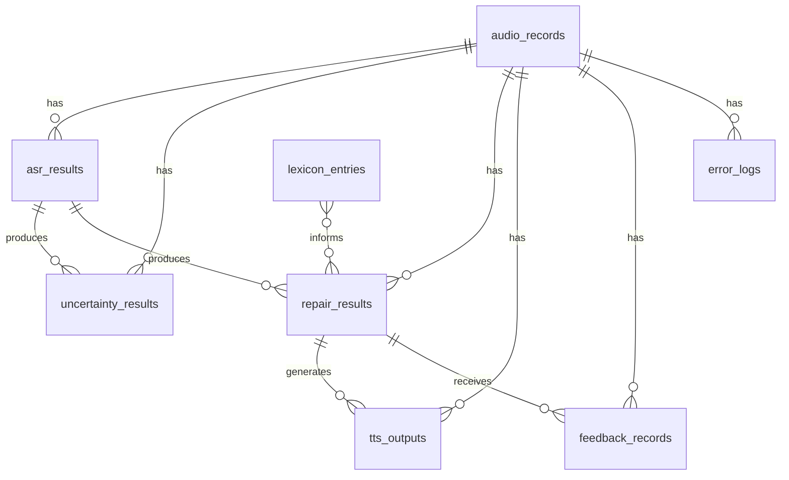

# Database Design

**Product Name:** SpeechBridge
**Version:** 1.0
**Last Updated:** 2026-05-30

---

## 1. Overview

SpeechBridge V1 uses **SQLite** as its primary database. The schema is designed to be PostgreSQL-compatible for future migration.

The database stores metadata, analysis results, feedback, and lexicon entries. Audio files and TTS output files are stored in the file system, not in the database.

---

## 2. Table Definitions

### 2.1 audio_records

Stores metadata for each uploaded or recorded audio file.

```sql
CREATE TABLE audio_records (
    id              TEXT PRIMARY KEY,
    file_name       TEXT NOT NULL,
    file_path       TEXT NOT NULL,
    duration        REAL NOT NULL,
    source_type     TEXT NOT NULL CHECK (source_type IN ('recording', 'upload')),
    format          TEXT NOT NULL,
    sample_rate     INTEGER,
    channels        INTEGER,
    file_size       INTEGER NOT NULL,
    created_at      TIMESTAMP NOT NULL DEFAULT CURRENT_TIMESTAMP
);
```

| Column | Type | Description |
|---|---|---|
| `id` | TEXT (UUID) | Primary key |
| `file_name` | TEXT | Original file name |
| `file_path` | TEXT | Internal storage path (not exposed to frontend) |
| `duration` | REAL | Audio duration in seconds |
| `source_type` | TEXT | "recording" or "upload" |
| `format` | TEXT | File format (wav, mp3, m4a, webm) |
| `sample_rate` | INTEGER | Sample rate in Hz (nullable) |
| `channels` | INTEGER | Number of audio channels (nullable) |
| `file_size` | INTEGER | File size in bytes |
| `created_at` | TIMESTAMP | Creation timestamp |

---

### 2.2 asr_results

Stores automatic speech recognition output for each audio file.

```sql
CREATE TABLE asr_results (
    id              TEXT PRIMARY KEY,
    audio_id        TEXT NOT NULL,
    model_name      TEXT NOT NULL,
    raw_text        TEXT NOT NULL,
    segments_json   TEXT NOT NULL,
    language        TEXT,
    processing_time REAL,
    created_at      TIMESTAMP NOT NULL DEFAULT CURRENT_TIMESTAMP,
    FOREIGN KEY (audio_id) REFERENCES audio_records(id) ON DELETE CASCADE
);
```

| Column | Type | Description |
|---|---|---|
| `id` | TEXT (UUID) | Primary key |
| `audio_id` | TEXT | Reference to `audio_records.id` |
| `model_name` | TEXT | ASR model identifier (e.g., "faster-whisper-large-v3") |
| `raw_text` | TEXT | Full transcription text |
| `segments_json` | TEXT | JSON array of segments (start, end, text, confidence) |
| `language` | TEXT | Detected language code (nullable) |
| `processing_time` | REAL | Processing duration in seconds (nullable) |
| `created_at` | TIMESTAMP | Creation timestamp |

**segments_json schema:**

```json
[
    {
        "start": 0.0,
        "end": 2.5,
        "text": "hello world",
        "confidence": 0.95
    }
]
```

---

### 2.3 uncertainty_results

Stores uncertainty detection output identifying high-risk regions in ASR output.

```sql
CREATE TABLE uncertainty_results (
    id                  TEXT PRIMARY KEY,
    audio_id            TEXT NOT NULL,
    asr_result_id       TEXT NOT NULL,
    uncertain_spans_json TEXT NOT NULL,
    risk_score          REAL NOT NULL,
    created_at          TIMESTAMP NOT NULL DEFAULT CURRENT_TIMESTAMP,
    FOREIGN KEY (audio_id) REFERENCES audio_records(id) ON DELETE CASCADE,
    FOREIGN KEY (asr_result_id) REFERENCES asr_results(id) ON DELETE CASCADE
);
```

| Column | Type | Description |
|---|---|---|
| `id` | TEXT (UUID) | Primary key |
| `audio_id` | TEXT | Reference to `audio_records.id` |
| `asr_result_id` | TEXT | Reference to `asr_results.id` |
| `uncertain_spans_json` | TEXT | JSON array of uncertain spans |
| `risk_score` | REAL | Overall risk score (0.0–1.0) |
| `created_at` | TIMESTAMP | Creation timestamp |

**uncertain_spans_json schema:**

```json
[
    {
        "start": 3,
        "end": 8,
        "text": "teh",
        "risk_type": "low_confidence",
        "risk_score": 0.85,
        "suggested_alternatives": ["the", "ten"]
    },
    {
        "start": 15,
        "end": 20,
        "text": "nukular",
        "risk_type": "substitution",
        "risk_score": 0.92,
        "suggested_alternatives": ["nuclear"]
    }
]
```

**risk_type values:**

- `low_confidence` — ASR confidence below threshold
- `entity` — Named entity (person, place, organization)
- `number` — Numeric value
- `technical_term` — Domain-specific terminology
- `disfluency` — Speech disfluency (filler, repetition, false start)
- `incomplete` — Incomplete phrase
- `substitution` — Likely substitution error

---

### 2.4 repair_results

Stores semantic repair output from LLM-based correction.

```sql
CREATE TABLE repair_results (
    id              TEXT PRIMARY KEY,
    audio_id        TEXT NOT NULL,
    asr_result_id   TEXT NOT NULL,
    repaired_text   TEXT NOT NULL,
    standard_text   TEXT NOT NULL,
    edits_json      TEXT NOT NULL,
    repair_model    TEXT NOT NULL,
    processing_time REAL,
    created_at      TIMESTAMP NOT NULL DEFAULT CURRENT_TIMESTAMP,
    FOREIGN KEY (audio_id) REFERENCES audio_records(id) ON DELETE CASCADE,
    FOREIGN KEY (asr_result_id) REFERENCES asr_results(id) ON DELETE CASCADE
);
```

| Column | Type | Description |
|---|---|---|
| `id` | TEXT (UUID) | Primary key |
| `audio_id` | TEXT | Reference to `audio_records.id` |
| `asr_result_id` | TEXT | Reference to `asr_results.id` |
| `repaired_text` | TEXT | Text after semantic repair |
| `standard_text` | TEXT | Final standardized expression |
| `edits_json` | TEXT | JSON array of individual edits |
| `repair_model` | TEXT | LLM model identifier used for repair |
| `processing_time` | REAL | Processing duration in seconds (nullable) |
| `created_at` | TIMESTAMP | Creation timestamp |

**edits_json schema:**

```json
[
    {
        "original": "teh quik brown fox",
        "repaired": "the quick brown fox",
        "start": 0,
        "end": 20,
        "reason": "spelling correction",
        "confidence": 0.98
    }
]
```

---

### 2.5 tts_outputs

Stores text-to-speech output metadata.

```sql
CREATE TABLE tts_outputs (
    id              TEXT PRIMARY KEY,
    audio_id        TEXT NOT NULL,
    repair_result_id TEXT NOT NULL,
    voice_type      TEXT NOT NULL DEFAULT 'standard',
    tts_path        TEXT NOT NULL,
    duration        REAL,
    processing_time REAL,
    created_at      TIMESTAMP NOT NULL DEFAULT CURRENT_TIMESTAMP,
    FOREIGN KEY (audio_id) REFERENCES audio_records(id) ON DELETE CASCADE,
    FOREIGN KEY (repair_result_id) REFERENCES repair_results(id) ON DELETE CASCADE
);
```

| Column | Type | Description |
|---|---|---|
| `id` | TEXT (UUID) | Primary key |
| `audio_id` | TEXT | Reference to `audio_records.id` |
| `repair_result_id` | TEXT | Reference to `repair_results.id` |
| `voice_type` | TEXT | Voice identifier (default: "standard") |
| `tts_path` | TEXT | Internal file path of TTS audio |
| `duration` | REAL | TTS audio duration in seconds (nullable) |
| `processing_time` | REAL | Processing duration in seconds (nullable) |
| `created_at` | TIMESTAMP | Creation timestamp |

---

### 2.6 feedback_records

Stores user feedback on analysis results.

```sql
CREATE TABLE feedback_records (
    id              TEXT PRIMARY KEY,
    audio_id        TEXT NOT NULL,
    repair_result_id TEXT NOT NULL,
    feedback_type   TEXT NOT NULL CHECK (feedback_type IN ('good', 'needs_improvement', 'bad')),
    corrected_text  TEXT,
    error_category  TEXT,
    comment         TEXT,
    created_at      TIMESTAMP NOT NULL DEFAULT CURRENT_TIMESTAMP,
    FOREIGN KEY (audio_id) REFERENCES audio_records(id) ON DELETE CASCADE,
    FOREIGN KEY (repair_result_id) REFERENCES repair_results(id) ON DELETE CASCADE
);
```

| Column | Type | Description |
|---|---|---|
| `id` | TEXT (UUID) | Primary key |
| `audio_id` | TEXT | Reference to `audio_records.id` |
| `repair_result_id` | TEXT | Reference to `repair_results.id` |
| `feedback_type` | TEXT | "good", "needs_improvement", or "bad" |
| `corrected_text` | TEXT | User-provided corrected text (nullable) |
| `error_category` | TEXT | Error type (nullable, e.g., "wrong_word", "missing_word", "extra_word") |
| `comment` | TEXT | Free-text user comment (nullable) |
| `created_at` | TIMESTAMP | Creation timestamp |

---

### 2.7 lexicon_entries

Stores user-managed vocabulary for improved recognition.

```sql
CREATE TABLE lexicon_entries (
    id          TEXT PRIMARY KEY,
    term        TEXT NOT NULL,
    pronunciation TEXT,
    category    TEXT NOT NULL DEFAULT 'other' CHECK (category IN ('person', 'place', 'technical', 'organization', 'other')),
    domain      TEXT,
    source      TEXT NOT NULL DEFAULT 'user' CHECK (source IN ('user', 'system', 'feedback')),
    notes       TEXT,
    created_at  TIMESTAMP NOT NULL DEFAULT CURRENT_TIMESTAMP,
    updated_at  TIMESTAMP NOT NULL DEFAULT CURRENT_TIMESTAMP
);
```

| Column | Type | Description |
|---|---|---|
| `id` | TEXT (UUID) | Primary key |
| `term` | TEXT | The lexicon term |
| `pronunciation` | TEXT | Phonetic representation (nullable) |
| `category` | TEXT | Term category |
| `domain` | TEXT | Domain tag (nullable, e.g., "medical", "legal", "tech") |
| `source` | TEXT | Origin of the entry |
| `notes` | TEXT | User notes (nullable) |
| `created_at` | TIMESTAMP | Creation timestamp |
| `updated_at` | TIMESTAMP | Last update timestamp |

---

### 2.8 error_logs

Stores processing errors for debugging and system improvement.

```sql
CREATE TABLE error_logs (
    id              TEXT PRIMARY KEY,
    audio_id        TEXT,
    error_type      TEXT NOT NULL,
    error_message   TEXT NOT NULL,
    raw_fragment    TEXT,
    repaired_fragment TEXT,
    final_fragment  TEXT,
    stack_trace     TEXT,
    created_at      TIMESTAMP NOT NULL DEFAULT CURRENT_TIMESTAMP,
    FOREIGN KEY (audio_id) REFERENCES audio_records(id) ON DELETE SET NULL
);
```

| Column | Type | Description |
|---|---|---|
| `id` | TEXT (UUID) | Primary key |
| `audio_id` | TEXT | Reference to `audio_records.id` (nullable) |
| `error_type` | TEXT | Error classification |
| `error_message` | TEXT | Error description |
| `raw_fragment` | TEXT | Original ASR text fragment (nullable) |
| `repaired_fragment` | TEXT | Repaired text fragment (nullable) |
| `final_fragment` | TEXT | Final text fragment (nullable) |
| `stack_trace` | TEXT | Technical stack trace (nullable) |
| `created_at` | TIMESTAMP | Creation timestamp |

**error_type values:**

- `asr_failure` — ASR processing failed
- `repair_failure` — LLM repair failed or returned invalid output
- `tts_failure` — TTS generation failed
- `audio_error` — Audio file corrupted or unsupported
- `timeout` — Processing exceeded time limit
- `api_error` — External API call failed
- `unknown` — Unclassified error

---

## 3. Entity Relationships



### Relationship Description

- **audio_records → asr_results:** One audio file produces one ASR result per processing run. In V1, one-to-one. Future versions may support multiple ASR models producing multiple results per audio.

- **asr_results → uncertainty_results:** One ASR result produces one uncertainty analysis. One-to-one relationship.

- **asr_results → repair_results:** One ASR result produces one repair result. One-to-one relationship. The repair result references the ASR result it was derived from.

- **repair_results → tts_outputs:** One repair result produces one TTS output. One-to-one relationship.

- **repair_results → feedback_records:** One repair result can receive multiple feedback records. One-to-many relationship.

- **audio_records → error_logs:** One audio record can have multiple error logs. One-to-many relationship. Error logs reference audio records optionally (some errors may not be associated with specific audio).

- **lexicon_entries → repair_results:** Lexicon entries inform the repair process. This is a logical relationship (lexicon data is passed to the LLM prompt), not a foreign key relationship.

---

## 4. Indexes

```sql
-- Audio records
CREATE INDEX idx_audio_records_created_at ON audio_records(created_at);
CREATE INDEX idx_audio_records_source_type ON audio_records(source_type);

-- ASR results
CREATE INDEX idx_asr_results_audio_id ON asr_results(audio_id);

-- Uncertainty results
CREATE INDEX idx_uncertainty_results_audio_id ON uncertainty_results(audio_id);
CREATE INDEX idx_uncertainty_results_asr_result_id ON uncertainty_results(asr_result_id);

-- Repair results
CREATE INDEX idx_repair_results_audio_id ON repair_results(audio_id);
CREATE INDEX idx_repair_results_asr_result_id ON repair_results(asr_result_id);

-- TTS outputs
CREATE INDEX idx_tts_outputs_audio_id ON tts_outputs(audio_id);

-- Feedback records
CREATE INDEX idx_feedback_records_audio_id ON feedback_records(audio_id);
CREATE INDEX idx_feedback_records_feedback_type ON feedback_records(feedback_type);

-- Lexicon entries
CREATE INDEX idx_lexicon_entries_term ON lexicon_entries(term);
CREATE INDEX idx_lexicon_entries_category ON lexicon_entries(category);
CREATE INDEX idx_lexicon_entries_domain ON lexicon_entries(domain);

-- Error logs
CREATE INDEX idx_error_logs_audio_id ON error_logs(audio_id);
CREATE INDEX idx_error_logs_error_type ON error_logs(error_type);
CREATE INDEX idx_error_logs_created_at ON error_logs(created_at);
```

---

## 5. Migration Notes

### 5.1 SQLite to PostgreSQL

When migrating from SQLite to PostgreSQL:

1. **UUID generation:** SQLite stores UUIDs as TEXT. PostgreSQL can use native `UUID` type with `gen_random_uuid()` or `uuid_generate_v4()`.

2. **Timestamps:** SQLite stores timestamps as TEXT. PostgreSQL uses native `TIMESTAMP` or `TIMESTAMPTZ` type. Recommend `TIMESTAMPTZ` for timezone awareness.

3. **JSON storage:** SQLite stores JSON as TEXT. PostgreSQL provides native `JSONB` type with indexing and query capabilities. Migrate `segments_json`, `uncertain_spans_json`, and `edits_json` to `JSONB`.

4. **Booleans:** SQLite uses INTEGER (0/1) for booleans. PostgreSQL uses native `BOOLEAN` type.

5. **Text search:** SQLite uses LIKE for text search. PostgreSQL provides `tsvector` and `tsquery` for full-text search on `raw_text`, `repaired_text`, and `standard_text` fields.

6. **Foreign keys:** SQLite enforces foreign keys only when `PRAGMA foreign_keys = ON`. PostgreSQL enforces foreign keys by default.

7. **Auto-increment:** SQLite uses `AUTOINCREMENT` on INTEGER PRIMARY KEY. PostgreSQL uses `SERIAL` or `GENERATED ALWAYS AS IDENTITY`.

### 5.2 PostgreSQL Schema Example

```sql
-- PostgreSQL version of audio_records
CREATE TABLE audio_records (
    id              UUID PRIMARY KEY DEFAULT gen_random_uuid(),
    file_name       VARCHAR(255) NOT NULL,
    file_path       VARCHAR(512) NOT NULL,
    duration        REAL NOT NULL,
    source_type     VARCHAR(20) NOT NULL CHECK (source_type IN ('recording', 'upload')),
    format          VARCHAR(10) NOT NULL,
    sample_rate     INTEGER,
    channels        INTEGER,
    file_size       BIGINT NOT NULL,
    created_at      TIMESTAMPTZ NOT NULL DEFAULT NOW()
);
```

### 5.3 ORM Compatibility

The application uses SQLAlchemy as the ORM layer. SQLAlchemy abstracts database-specific features, allowing the same model definitions to work with both SQLite and PostgreSQL. Key considerations:

- Use `sqlalchemy.types.JSON` for JSON columns (maps to TEXT in SQLite, JSONB in PostgreSQL)
- Use `sqlalchemy.types.DateTime` for timestamps (maps to TEXT in SQLite, TIMESTAMPTZ in PostgreSQL)
- Use `sqlalchemy.types.Uuid` or `sqlalchemy.types.String` for UUID columns

---

## 6. Data Retention

### 6.1 V1 Policy

- Audio files: Retained until user deletes them
- Analysis results: Retained until user deletes the associated audio
- Feedback: Retained indefinitely for system improvement
- Lexicon: Retained until user deletes entries
- Error logs: Retained for 30 days, then archived or deleted

### 6.2 Future Considerations

- Implement user data export (GDPR compliance)
- Implement cascading deletion (delete audio → delete all associated results)
- Implement soft deletion for audit trail
- Implement data archival for old records

---

*This document describes the database design for SpeechBridge V1. It should be updated as the schema evolves through subsequent development phases.*
