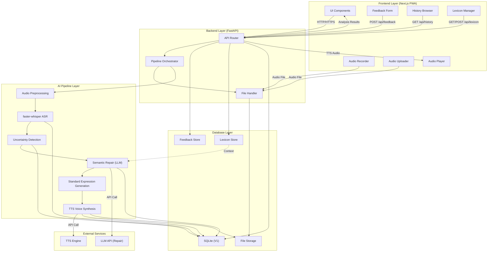

# System Architecture

**Product Name:** SpeechBridge
**Version:** 1.0
**Last Updated:** 2026-05-30

---

## 1. Overview

SpeechBridge is a full-stack application consisting of four major layers:

1. **Frontend Layer** — Next.js PWA deployed to Vercel
2. **Backend Layer** — FastAPI application handling API, orchestration, and file management
3. **AI Pipeline Layer** — Modular service chain for speech processing, repair, and synthesis
4. **Database Layer** — SQLite (V1), with PostgreSQL migration path

The system follows a strict separation of concerns. The frontend handles only recording, upload, visualization, and user interaction. All AI processing occurs on the backend. The AI pipeline is composed of discrete services that communicate through well-defined interfaces.

---

## 2. Architecture Diagram



---

## 3. Frontend Layer

### 3.1 Technology Stack

| Technology | Purpose |
|---|---|
| Next.js (App Router) | Framework, routing, SSR/SSG |
| TypeScript | Type safety |
| Tailwind CSS | Utility-first styling |
| shadcn/ui | Component library |
| PWA (manifest + SW) | Installability, offline shell |

### 3.2 Deployment

The frontend is deployed to Vercel. It communicates with the backend over HTTPS. Environment variables configure the backend API URL.

### 3.3 Responsibilities

The frontend is responsible for:

- **Recording:** Capturing audio via `getUserMedia` and `MediaRecorder`
- **Uploading:** Sending audio files to the backend
- **Visualization:** Displaying ASR text, uncertain spans, repaired text, and diffs
- **Feedback:** Collecting user ratings and corrections
- **History:** Browsing past analyses
- **Lexicon:** Managing custom vocabulary
- **Settings:** User preferences and configuration

The frontend is NOT responsible for:

- Running ASR models
- Performing semantic repair
- Generating TTS audio
- Storing sensitive audio data
- AI model orchestration

### 3.4 Frontend Architecture

```
frontend/
├── app/                    # Next.js App Router pages
│   ├── page.tsx            # Home / Dashboard
│   ├── speak/              # Record / Upload
│   ├── result/[id]/        # Analysis detail
│   ├── history/            # History list
│   ├── lexicon/            # Lexicon manager
│   └── settings/           # Profile / Settings
├── components/             # Shared UI components
│   ├── ui/                 # shadcn/ui primitives
│   ├── audio/              # Recorder, Player, Uploader
│   ├── text/               # Transcript viewers, diff viewer
│   └── layout/             # Navigation, shell
├── features/               # Feature-specific components and hooks
│   ├── recording/
│   ├── analysis/
│   ├── history/
│   └── lexicon/
├── services/               # API client functions
│   ├── audio.service.ts
│   ├── analysis.service.ts
│   ├── feedback.service.ts
│   ├── lexicon.service.ts
│   └── history.service.ts
├── types/                  # Shared TypeScript types
│   ├── audio.types.ts
│   ├── analysis.types.ts
│   └── api.types.ts
├── lib/                    # Utilities
│   ├── api.ts              # HTTP client
│   └── audio.ts            # Audio helpers
├── public/                 # Static assets, manifest, icons
└── styles/                 # Global styles
```

### 3.5 Key Design Decisions

- **App Router:** Provides file-based routing, layouts, and server components. Default choice for new Next.js projects.
- **Service layer:** All API calls are placed in `services/` files, not inside UI components. This keeps components testable and API logic reusable.
- **Feature modules:** Complex features (recording, analysis) have their own directories under `features/` to keep related components, hooks, and logic co-located.
- **Typed API responses:** All API responses are typed in `types/`. This prevents runtime type errors and improves developer experience.

---

## 4. Backend Layer

### 4.1 Technology Stack

| Technology | Purpose |
|---|---|
| FastAPI | Web framework |
| Python 3.11+ | Runtime |
| Pydantic | Request/response validation |
| Uvicorn | ASGI server |
| SQLite (V1) | Database |

### 4.2 Responsibilities

The backend is responsible for:

- **API:** Serving HTTP endpoints for the frontend
- **Orchestration:** Coordinating the AI pipeline
- **File handling:** Receiving, validating, storing, and serving audio files
- **Database:** Persisting metadata, results, feedback, and lexicon
- **Security:** Validating inputs, protecting secrets, enforcing CORS

### 4.3 Backend Architecture

```
backend/
├── app/
│   ├── main.py                 # FastAPI app entry point
│   ├── api/                    # Route handlers (thin)
│   │   ├── audio.py
│   │   ├── analysis.py
│   │   ├── feedback.py
│   │   ├── lexicon.py
│   │   ├── history.py
│   │   └── health.py
│   ├── services/               # Business logic
│   │   ├── audio_service.py
│   │   ├── asr_service.py
│   │   ├── uncertainty_service.py
│   │   ├── repair_service.py
│   │   ├── tts_service.py
│   │   ├── feedback_service.py
│   │   ├── lexicon_service.py
│   │   ├── history_service.py
│   │   └── adaptation_service.py
│   ├── db/                     # Database access layer
│   │   ├── database.py         # Connection, session
│   │   ├── models.py           # SQLAlchemy models
│   │   └── repositories.py     # Data access functions
│   ├── schemas/                # Pydantic schemas
│   │   ├── audio.py
│   │   ├── analysis.py
│   │   ├── feedback.py
│   │   └── lexicon.py
│   ├── core/                   # Configuration, security
│   │   ├── config.py
│   │   └── security.py
│   └── utils/                  # Shared utilities
│       ├── audio_utils.py
│       └── file_utils.py
├── data/                       # SQLite DB, file storage
├── tests/                      # Test suite
└── requirements.txt            # Python dependencies
```

### 4.4 Key Design Decisions

- **Router-service separation:** Route handlers in `api/` are thin. They validate input, call a service, and return the result. All business logic lives in `services/`.
- **Pydantic schemas:** Request and response data is validated through Pydantic models in `schemas/`. This provides automatic validation, serialization, and documentation.
- **Repository pattern:** Database access is abstracted through repository functions in `db/repositories.py`. This allows swapping SQLite for PostgreSQL without changing service logic.
- **Service classes:** Each major capability is encapsulated in a service class. Services are instantiated with their dependencies (database session, configuration) and expose clear public methods.

---

## 5. AI Pipeline Layer

The AI pipeline is the core of SpeechBridge. It transforms raw audio into standardized, understandable expression through a sequence of discrete processing stages.

### 5.1 Pipeline Stages

```
Audio Input
  → Audio Preprocessing
    → ASR (faster-whisper)
      → Uncertainty Detection
        → Semantic Repair (LLM)
          → Standard Expression Generation
            → TTS Voice Synthesis
              → Output Delivery
```

### 5.2 Stage Details

#### Stage 1: Audio Preprocessing

**Service:** `AudioService`

- Receive uploaded or recorded audio file
- Validate file format and size
- Normalize audio (sample rate, channels, bit depth)
- Convert to format required by ASR engine
- Store original file for reproducibility
- Return normalized file path and metadata

#### Stage 2: ASR (faster-whisper)

**Service:** `ASRService`

- Load faster-whisper model (configurable model size)
- Transcribe normalized audio
- Produce timestamped segments with confidence scores
- Return structured ASR output:
  - Full text
  - Segments (start, end, text, confidence)
  - Detected language
- Store ASR results in database

#### Stage 3: Uncertainty Detection

**Service:** `UncertaintyService`

- Analyze ASR output for high-risk regions
- Identify low-confidence spans
- Detect named entities, numbers, technical terms
- Detect speech disfluency (repetitions, fillers, false starts)
- Detect incomplete phrases
- Produce structured uncertainty output:
  - Span positions (start, end)
  - Risk type (low_confidence, entity, number, disfluency, etc.)
  - Risk score
  - Suggested alternatives (when available)
- Store uncertainty results in database

#### Stage 4: Semantic Repair (LLM)

**Service:** `RepairService`

- Construct constrained repair prompt:
  - Original ASR text
  - Uncertain spans with context
  - Domain lexicon (if available)
  - Repair instructions (constrained, not free rewrite)
- Call LLM API
- Parse LLM response for repairs:
  - Original span → Repaired span
  - Reason for change
  - Confidence in repair
- Apply repairs to text
- Preserve high-confidence text exactly
- Return repaired text with edit log
- Store repair results in database

#### Stage 5: Standard Expression Generation

**Service:** `RepairService` (continued)

- Apply grammar and style normalization to repaired text
- Generate standardized expression
- Produce diff between ASR output, repaired text, and standardized text
- Generate optional explanation of changes
- Return all text variants

#### Stage 6: TTS Voice Synthesis

**Service:** `TTSService`

- Take standardized text as input
- Call TTS engine to generate speech
- Store TTS audio file
- Return file path and metadata
- Store TTS results in database

#### Stage 7: Output Delivery

**Service:** Orchestrator

- Assemble final response:
  - Audio metadata
  - Raw ASR text with segments
  - Uncertain spans
  - Repaired text with edits
  - Standardized expression text
  - TTS audio file reference
  - Processing metadata (timing, models used)
- Return to frontend

### 5.3 Pipeline Orchestration

The pipeline is orchestrated by the backend. When a user submits audio:

1. `AudioService` preprocesses and stores the file
2. `ASRService` transcribes the audio
3. `UncertaintyService` identifies risky regions
4. `RepairService` applies semantic repair
5. `TTSService` generates voice output
6. Results are assembled and returned

In V1, this pipeline runs synchronously. The API endpoint blocks until all stages complete. This is acceptable for V1 because:

- Target audio length is under 10 minutes
- Processing time target is under 30 seconds
- The frontend can show a loading state

Future versions should support asynchronous processing with background jobs and webhook callbacks for long-running tasks.

---

## 6. Database Layer

### 6.1 V1: SQLite

SQLite is used for V1 because:

- Zero configuration
- Single-file deployment
- Sufficient for development and small-scale usage
- Easy migration path to PostgreSQL

### 6.2 Future: PostgreSQL

The database layer is designed with migration to PostgreSQL in mind:

- All SQL uses standard syntax where possible
- ORM layer (SQLAlchemy) abstracts database-specific features
- Repository pattern isolates database access
- Schema design uses PostgreSQL-compatible types

### 6.3 Database Responsibilities

The database stores:

- **Audio metadata:** File paths, durations, source types
- **ASR results:** Transcription text, segments, confidence scores
- **Uncertainty results:** Risky spans, risk types, scores
- **Repair results:** Repaired text, edit logs, models used
- **TTS outputs:** File paths, voice types
- **Feedback records:** User ratings, corrections, comments
- **Lexicon entries:** Custom terms, categories, domains
- **Error logs:** Processing errors, raw fragments, repairs

The database does NOT store:

- Raw audio files (stored in file system)
- TTS audio files (stored in file system)
- API keys or credentials (stored in environment variables)

See [DATABASE.md](./DATABASE.md) for detailed schema design.

---

## 7. External Service Integration

### 7.1 LLM API (Semantic Repair)

- Used by: `RepairService`
- Purpose: Constrained semantic repair of ASR output
- Integration: HTTP API call with structured prompt
- Configuration: API key in environment variables
- Fallback: Return raw ASR text if LLM is unavailable

### 7.2 TTS Engine

- Used by: `TTSService`
- Purpose: Text-to-speech synthesis
- Integration: HTTP API call or local engine
- Configuration: Engine selection and credentials in environment variables
- Fallback: Return text-only output if TTS is unavailable

---

## 8. Security Architecture

### 8.1 Data Security

- Audio files are stored in a protected directory
- Audio file paths are not exposed in API responses (only internal references)
- Database does not store raw audio content
- Audio files can be deleted by the user

### 8.2 API Security

- All API communication over HTTPS
- CORS configured for frontend domain only
- Input validation on all endpoints (file type, size, request body)
- Rate limiting on upload and analysis endpoints
- No API keys or credentials in frontend code

### 8.3 Environment Configuration

- All secrets stored in environment variables
- `.env` files excluded from version control
- Production secrets managed through deployment platform (Vercel, server environment)

---

## 9. Deployment Architecture

### 9.1 Frontend

- **Platform:** Vercel
- **Build:** Next.js production build
- **CDN:** Vercel Edge Network
- **Domain:** Custom domain with HTTPS

### 9.2 Backend

- **V1:** Single server deployment (Vercel Serverless, Railway, or similar)
- **Future:** Containerized deployment with horizontal scaling
- **Database:** SQLite file on server (V1), managed PostgreSQL (future)
- **File storage:** Local filesystem (V1), object storage (future)

### 9.3 Communication

- Frontend → Backend: HTTPS REST API
- Backend → LLM API: HTTPS
- Backend → TTS Engine: HTTPS or local

---

## 10. Scalability Considerations

### 10.1 V1 Constraints

- Synchronous processing
- Single-server deployment
- SQLite database
- Local file storage

### 10.2 Migration Path

- **Database:** SQLite → PostgreSQL (schema-compatible)
- **Processing:** Synchronous → Background jobs (API-compatible)
- **File storage:** Local → Object storage (service-compatible)
- **Deployment:** Single server → Containerized (architecture-compatible)

Each migration can be performed independently without changing the overall architecture.

---

*This document describes the system architecture for SpeechBridge V1. It should be updated as the architecture evolves through subsequent development phases.*
